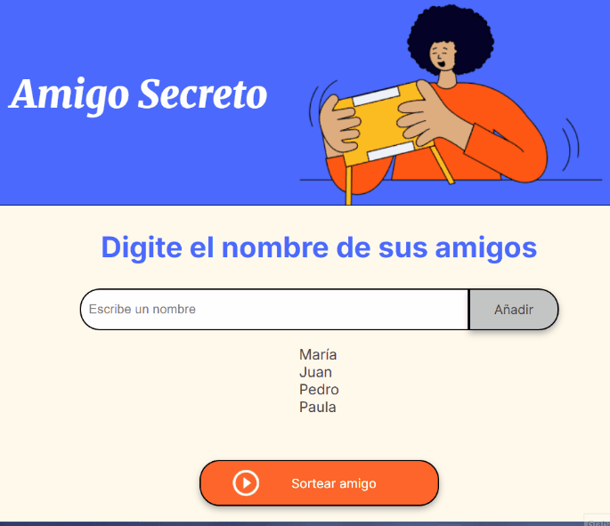

# 🎯 des-Afortunad@

Una ruleta interactiva que elige al “menos afortunad@” del grupo 😅  
Un proyecto simple y divertido creado con **HTML, CSS y JavaScript**, usando el lienzo **Canvas** para animar el giro, los efectos de luz y el logo central con brillo tipo neón 💡

---

## 🌀 Demo

👉 https://vercel.com/pablo-kloster/des-afortunadx

---

## ✨ Características

- Ruleta totalmente animada con **Canvas**  
- Efecto de **aceleración y frenado natural** al girar  
- **Logo central con efecto neón parpadeante**  
- **Botones interactivos**: cargar nombres, girar, y reiniciar  
- Indicador visual del estado de los botones (verde = listo, rojo = girando)  
- Mensaje dinámico con el nombre del ganador dentro de la barra de entrada  
- Diseño responsive y adaptable  

---

## 🛠️ Tecnologías utilizadas

- **HTML5**  
- **CSS3** (con animaciones y sombras)  
- **JavaScript (ES6)**  
- **Canvas API**  

---

## 🚀 Cómo usarlo

1. Abrí el proyecto en tu navegador (https://vercel.com/pablo-kloster/des-afortunadx).
2. Escribí los nombres de los participantes y agregalos con el botón verde ✅.
3. Pulsá el botón rojo 🔴 para hacer girar la ruleta.
4. El ganador se mostrará en el campo de entrada.  
5. Cuando quede un solo participante, el botón de reinicio 🔄 se activará.

---

## 💡 Inspiración

Este proyecto nació como una forma divertida de practicar lógica, animaciones y dibujo con Canvas.  
El nombre “des-Afortunad@” juega con la idea de elegir al *menos afortunado* del grupo 😜  

---

## 🧠 Autor

**Pablo Kloster**  
📍 Proyecto personal de práctica y aprendizaje.  
🔗 [LinkedIn] https://www.linkedin.com/in/pablo-kloster 
🔗 [GitHub] https://github.com/pablogkloster/desAfortun-
🔗 [Vercel] https://vercel.com/pablo-kloster/des-afortunadx

---

## 📸 Captura

---

## 🏷️ Licencia

Este proyecto se distribuye bajo la licencia **MIT**, libre para uso y modificación.

---

