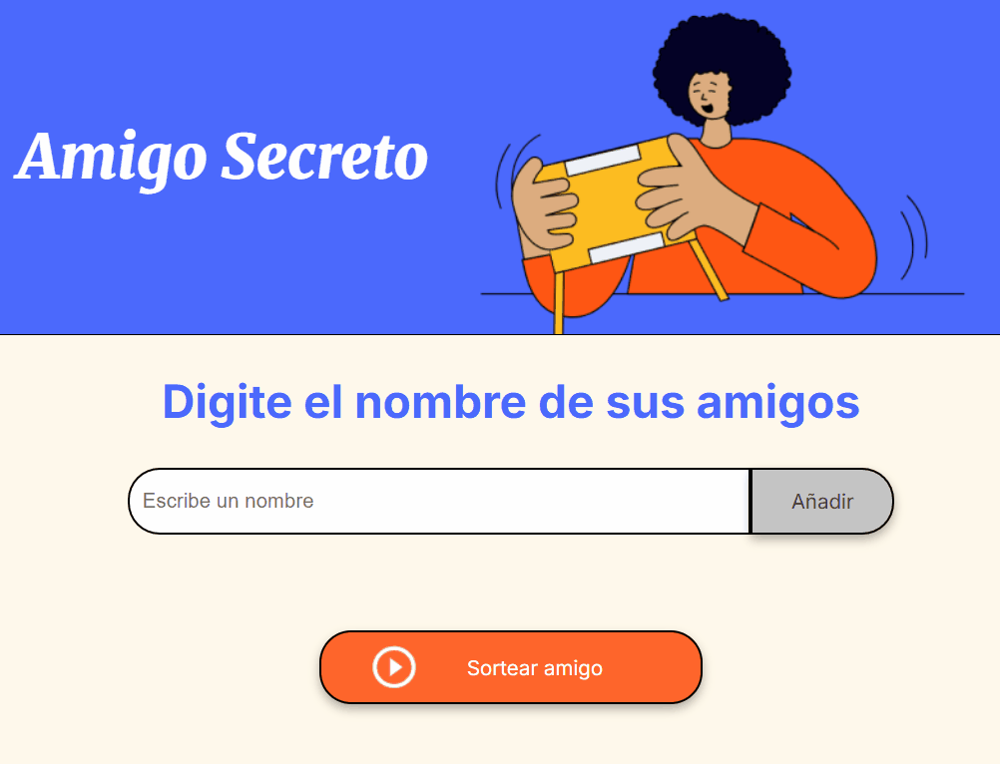
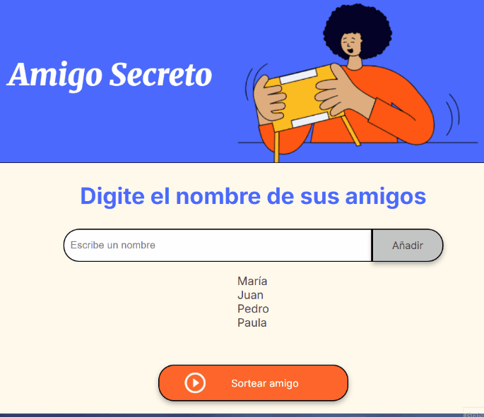

# 🎁 Amigo Secreto

---

## 📚 Índice

- [📝 Descripción del proyecto](#-descripción-del-proyecto)
- [⚙️ Funcionalidades](#️-funcionalidades)
- [👥 Cómo pueden usarlo los usuarios](#-cómo-pueden-usarlo-los-usuarios)
- [❓ Ayuda y soporte](#-ayuda-y-soporte)
- [👨‍💻 Autores del proyecto](#-autores-del-proyecto)

---

## 📝 Descripción del proyecto

**Amigo Secreto** es una aplicación web interactiva pensada para realizar sorteos aleatorios entre amigos, familiares o compañeros de trabajo. Permite ingresar nombres y seleccionar de forma aleatoria a un “amigo secreto” con tan solo unos clics. Es ideal para celebraciones, eventos o juegos sociales.

---

## ⚙️ Funcionalidades

- ✏️ **Agregar nombres**: los usuarios escriben un nombre en un campo de texto y lo agregan con el botón **"Añadir"**.
- 🚫 **Validación de entrada**: si el campo está vacío, se muestra una alerta solicitando un nombre.
- 📃 **Visualización de la lista**: todos los nombres ingresados se muestran en pantalla.
- 🎲 **Sorteo aleatorio**: el botón **"Sortear Amigo"** elige un nombre aleatoriamente de la lista.

---

## 👥 Cómo pueden usarlo los usuarios

1. Ingresar el nombre de un participante en el campo de texto, "Escribe un nombre".
3. Hacer clic en **"Añadir"** para agregarlo a la lista.
4. Repetir hasta tener a todos los participantes.
   
5. Presionar **"Sortear Amigo"** para revelar al afortunado.
6. Ver el resultado directamente en pantalla.
  
---

## ❓ Ayuda y soporte

Para dudas o sugerencias sobre el proyecto, puedes:

- Revisar los comentarios en el código fuente.
- Consultar futuras actualizaciones en esta misma página.
- Contactar a los autores a través del repositorio (issues o pull requests).

---

## 👨‍💻 Autores del proyecto

- 🚀 Proyecto desarrollado como parte de un desafío de programación.
- Autor: Pablo Kloster

---

